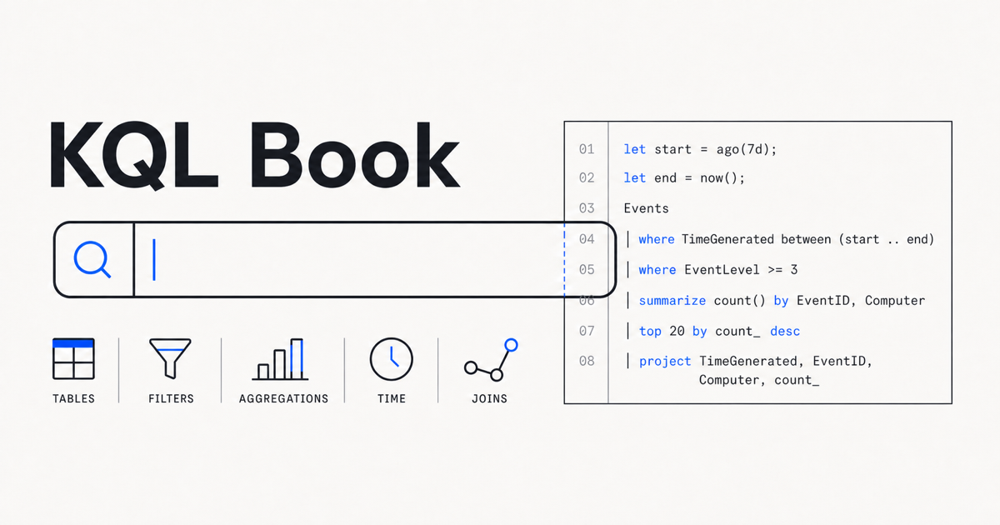
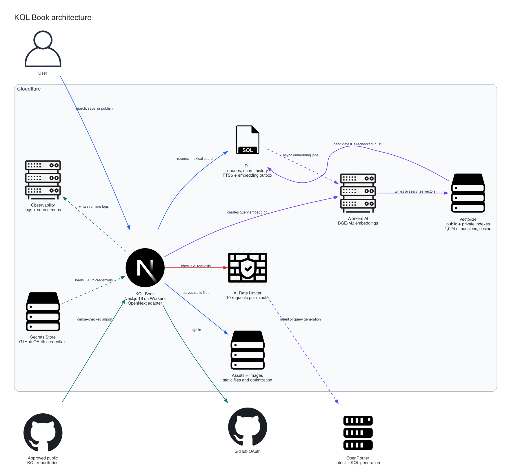

# KQL Book

KQL Book is a search website for Microsoft KQL queries. I built it to help
students, SOC analysts, and anyone learning KQL find useful examples without
searching through a bunch of separate repositories.

You can search public queries, read the code, check the original source, and
save examples for later. Signed-in users can also write their own queries. New
queries stay private unless the author chooses to publish them.

Before a signed-in user's query is saved, the backend checks it with Microsoft's
Kusto parser. Syntax errors, management commands, incomplete declaration-only
text, common non-KQL formats, and supported-dialect violations are rejected.
The same check runs on edits and before an older private query is published.
Secret detection remains a nonblocking warning.

## How it works

A user searches from the website, and KQL Book checks its query collection for
the closest matches. If the wording does not match well, it can look for queries
with a similar meaning. AI can draft a new query when the search does not find a
useful result.

Public examples can come from approved GitHub repositories or KQL Book users.
Imported queries keep a link to their original source and license. Any query
created by AI is marked as unverified so the user knows to check it before use.

## Why I built it

Useful KQL examples are spread across Microsoft documentation, GitHub
repositories, and personal notes. KQL Book puts those examples in one searchable
place and supports the main Microsoft KQL products I use while studying security.
